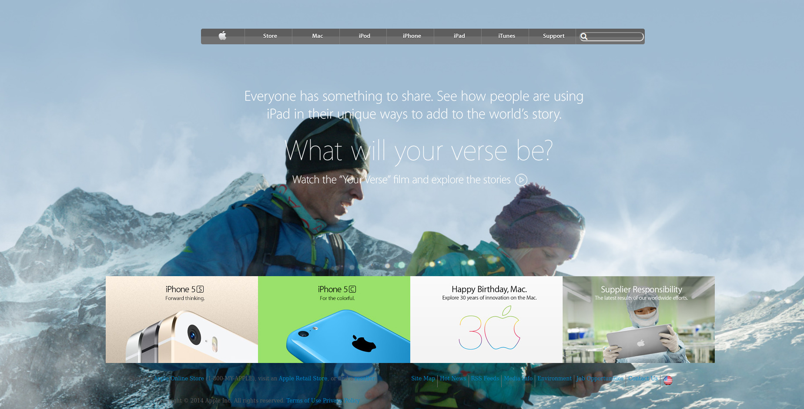

# Building_Backgrounds_and_Gradients_Apple

> Project: Building Backgrounds and Gradients Apple.

The third project for microverse, replicate this article from the New York Times: https://www.nytimes.com/2014/03/18/science/space/detection-of-waves-in-space-buttresses-landmark-theory-of-big-bang.html?_r=0

## Built With

- Html, css,
- Font awesome, normalizer.

## Live Demo

[Live Demo Link](https://ricardomonte.github.io/Building_Backgrounds_and_Gradients_Apple/. )

## Getting Started

**This is an example of how you may give instructions on setting up your project locally.**
**Modify this file to match your project, remove sections that don't apply. For example: delete the testing section if the currect project doesn't require testing.**

To get a local copy up and running follow these simple example steps.

### Prerequisites
Having a computer and git working.
### Setup
git clone https://github.com/ricardomonte/Building_Backgrounds_and_Gradients_Apple.git
### Usage
Open it in your favorite browser

## Authors

👤 **Author1**

- Github: [@ricardomonte](https://github.com/ricardomonte)
- Twitter: [@ramnkco](https://twitter.com/ramnkco)
- LinkedIn: [Ricardo Montenegro](https://www.linkedin.com/in/ricardo-antonio-montenegro-nu%C3%B1ez-87a74944/)

👤 **Author2**

- Github: [@Nexch](https://github.com/Nexch)
- Twitter: [@@MfinchT](https://twitter.com/MfinchT)
- Linkedin: [linkedin](www.linkedin.com/in/Nexch)

## 🤝 Contributing

Contributions, issues and feature requests are welcome!

Feel free to check the [issues page](issues/).

## Show your support

Give a :fire: if you like this project!

## Acknowledgments

- I will like to express my sincere gratitude to Microverse, for giving me and my partner, this incredible opportunity
- Microverse

## 📝 License

This project has no license.
